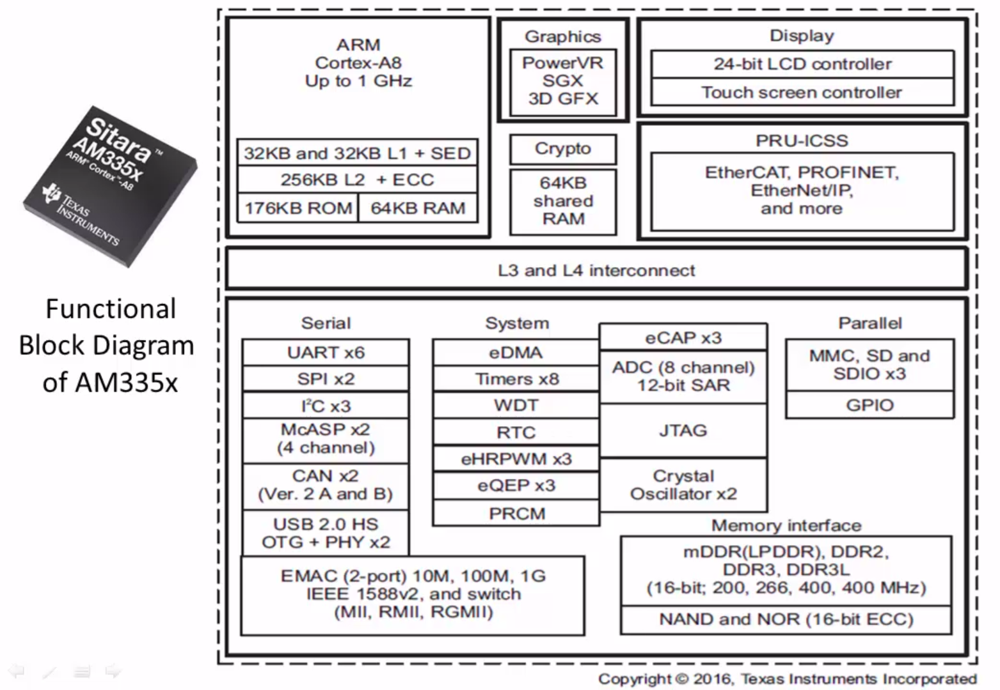
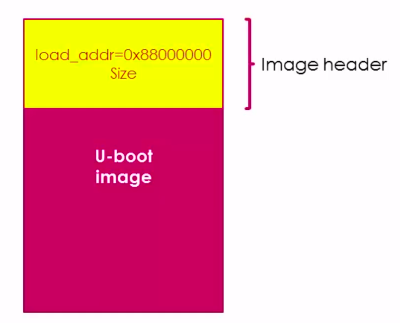
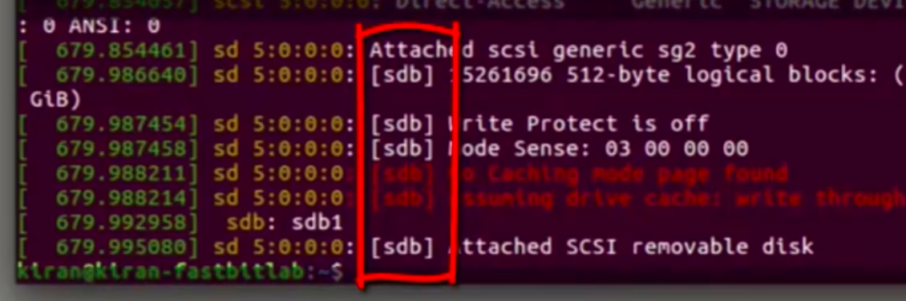
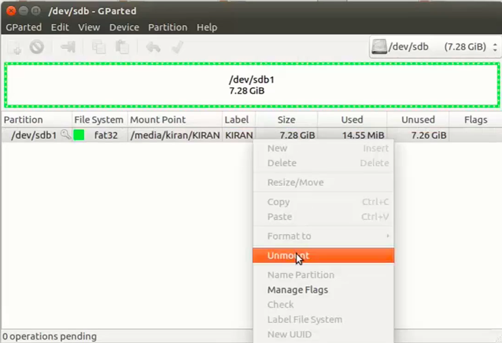
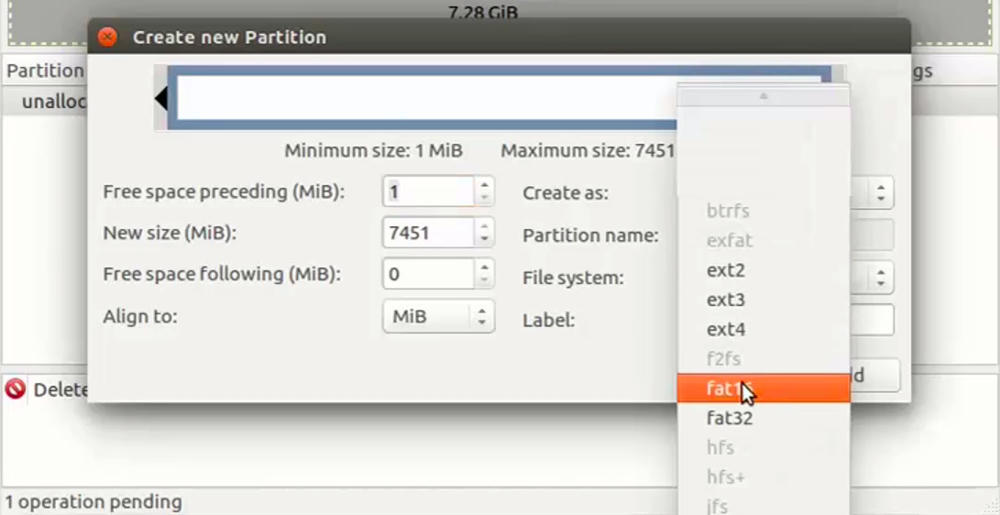
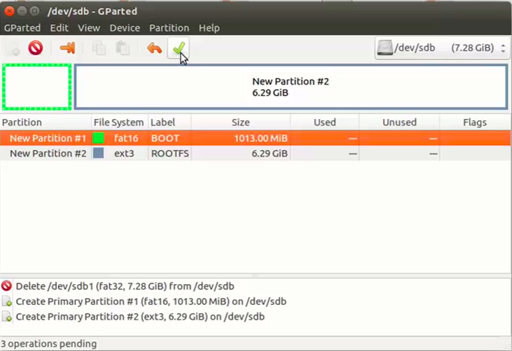

## Notes for Udemy course on 
# Embedded Linux Step by Step Using Beaglebone Black
* [Course Link](https://www.udemy.com/course/embedded-linux-step-by-step-using-beaglebone/?couponCode=KEEPLEARNING)
* [Github Repository](https://github.com/niekiran/EmbeddedLinuxBBB) for the course
* Board Used is [BeagleBone Black](https://www.beagleboard.org/boards/beaglebone-black)
* BeagleBone Black [Wikipedia Page](https://elinux.org/Beagleboard:BeagleBoneBlack#Revision_C_.28Production_Version.29) for Reference
* BeagleBone Black [System Reference Manual Rev C](https://github.com/beagleboard/beaglebone-black) for Reference
* Board Introduction to get started is on the Course [article page](https://www.udemy.com/course/embedded-linux-step-by-step-using-beaglebone/learn/lecture/7243972#content)

***
### Section 3
## AM335x Functional block Overview

* [AM335x SOC Documentation](https://www.ti.com/product/AM3358)
* [AM335x SOC Technical Reference Manual](https://www.ti.com/lit/ug/spruh73q/spruh73q.pdf?ts=1712401820224&ref_url=https%253A%252F%252Fwww.ti.com%252Fproduct%252FAM3359)

#### MMC Interface present on the Board
* MMC0 - connected to SD card slot on the board
* MMC1 - connected to eMMC storage on the board
***

### Section 4
## Beaglebone Linux booting Process

### RBL (ROM Boot Loader)
It is a small program pre-installed in the device's read-only memory (ROM). It acts as the very first piece of software that executes when the system powers on. Due to its size limitations, it just does some essential hardware configuration just required to load the secondary bootloader, often residing in external storage. This RBL is written by the vendor of the SOC and it is hardcoded when manufacturing, so cannot be changed by programmer/user. Also we cannot get the source code of it!! 
 

**Why is it required:**
* As the SOC vendor will not know which is the storage device / RAM used on the board while manufacturing the SOC. So he just initializes the processor and other hardware on the SOC and proceeds to load next Bootloader onto the Internal RAM.

**It's Main job is to:**
 
1) Setup the stack (similar to microcontroller startup code) in the processor.
 
2) Initialize and start the watchdog timer(WDT) to 3 Minutes. If the RBL do not load the second stage bootloader within 3 minutes, WDT will reset the board. This is done because while the RBL searches for the secondary bootloader it may lose itself in the code loop or may go to waiting loop of some protocol or get lost somewhere.
 
3) Setup the clock configuration using PLL (Phase locked loop). PLL is the component in the SOC to generate the comparitively low precision high frequency clock using high precision low frequency clock. For Example from 24Mhz high precision clock to 500Mhz low precision clock.
4) Search for the MLO in the boot source in the order assigned by the programmer(i.e. by checking the SYSBOOT pins of the SOC).
5) Copy MLO or SPL to internal SRAM of the SOC and pass the control to it.

**Additional point:** Some RBL give programmer to choose the boot source like by just changing the voltage level at the boot pins on the SOC. Some Boot source options on the BBB Board are:
1) NAND Flash
2) NOR Flash (eXecute In place, XIP)
3) USB
4) eMMC
5) SD card
6) Ethernet
7) UART
8) SPI

* When RBL fetches the SPL/MLO, it stores it in the Internal RAM of the SOC.

* Image header contains the load address in the RAM and the size of the SPL?. <!-- TODO -->

_And these are explained thoroughly in the Udemy course [article page.](https://www.udemy.com/course/embedded-linux-step-by-step-using-beaglebone/learn/lecture/7243996#overview)_

### SPL(Secondary Program Loader) / MLO (Memory LOader)
This compact bootloader performs basic hardware initialization and then fetches the larger, more feature-rich second-stage bootloader (typically U-Boot) from external storage like an SD card. 

**It's Main job is to:**
1) It does UART console initialization to print the debug messages.
2) It Reconfigure the PLL to desired value (if the programmer is not satisfied with the frequency selected by the RBL)
3) Initializes the DDR registers to use the DDR Memory.
4) It does Muxing configuration of the boot peripheral pins of the SOC, to select the correct function of the pins and other hardwares onboard. (For Eg. if user wants to boot from MMC0 instead MMC1 (which is default), then the SPL will choose the MMC0 functionalities of the pins).
5) Copies the U-Boot image to the DDR memory and passes control to it.

* Image header contains the load address in the RAM and the size of the U-boot image.
 
**Note that:** U-Boot has many features and functionality, so it cannot fit inside the internal SRAM of the SOC (unlike SPL), inevitably it should be loaded to the external RAM.

**Why is it required:**
* This is explained thorougly in the Udemy article page.
 
["Why AM335x RBL cannot load the Uboot directly to DDR?"](https://www.udemy.com/course/embedded-linux-step-by-step-using-beaglebone/learn/lecture/7828964#overview)
### U-boot (Teriary Bootloader)
U-Boot is a popular second-stage bootloader commonly used in embedded Linux systems. Unlike the smaller first-stage bootloaders residing in ROM, U-Boot is typically stored on external flash memory like NAND / NOR / eMMC storage / SD card. This allows for greater flexibility and features compared to the limited capabilities of the initial stage. U-Boot is responsible for more advanced tasks like recognizing and initializing various hardware components, loading the device tree (a configuration file describing the hardware), and ultimately launching the Linux kernel for a successful boot. It also provides a command-line interface for users to interact with the hardware, perform diagnostics, or even update the kernel itself.

**It's Main job is to:**
1) U-Boot prepares the hardware for further use by the operating system. This includes tasks like setting up the memory controller and enabling critical peripherals. 
 
2) U-Boot provides a command-line interface that allows users to interact with the device before booting the operating system. This is useful for troubleshooting, configuration, and running diagnostics.
 
3) U-Boot loads the operating system kernel (the core of the OS) and any additional data (device tree, ramdisk) from various storage devices like flash memory or network.

### Linux Kernel
The Linux kernel serves as the heart of the operating system. Unlike its desktop counterpart, the embedded kernel is a streamlined version tailored for the specific hardware and functionalities of the device. This focus on efficiency allows it to operate with limited resources like processing power and memory. The kernel manages core tasks like memory management, device drivers for interacting with hardware components, process scheduling, and network communication.  It acts as the foundation upon which higher-level applications and user interfaces can be built, enabling the embedded device to perform its designated functions.

### RFS (Root File System)
The root filesystem in embedded Linux is the foundation for the entire system operation. It resides on a non-volatile storage device like flash memory and serves as the central point for all essential files and directories.  Think of it as the root of a tree, where critical elements like the kernel itself, core system libraries, device drivers, and user applications all branch out. The structure of the root filesystem follows the Filesystem Hierarchy Standard (FHS), ensuring a consistent organization across different Linux systems. This standardized layout allows the system to locate necessary files efficiently and facilitates easier maintenance and updates.
***

## Booting BBB from the SD card

* Prebuilt binaries of MLO, U-boot, Linux image from Angstrom Repository can be found at:
 
[GitHub Page: Angstrom Demo](https://github.com/niekiran/EmbeddedLinuxBBB/tree/master/pre-built-images/Angstrom_Demo)

**Important Note:** For the following steps, Don't operate as the Super User(i.e. root) in the command line. If we require any higher privileges, we may use it with "sudo".
 
 
**Steps:**

1) Take an uSD card (4GB >= ) and partition it to two as shown below.

 
 
    a. Connect the uSD card to the Computer (Linux machine) and run the command `dmesg` and check for the device name(like sdb1 or sda2) of the uSD card.

 
    b. Install an app called "GParted" and open it.

 
    c. Choose the correct device from the list of devices.

 
    d. Umount the uSD card.

 
    e. Delete the partition.

 
    f. Create a new partition named "BOOT" with File system as "fat16" and size around 1GB (or 1024 MiB).

 
    g. Similarly create another partition named "ROOTFS" with File system as "ext3" and leave the size as it is (it will take the remaining size in the uSD card).

 
    h. Finally don't forget to click apply.
 
    k. Mark BOOT Partition as BOOT by going to manage flags and check the boot flag.

 
    l. Close the Application.
 
2. Next, Copy the MLO file to the BOOT partition of the uSD card and Rename it as "MLO". You need root privilege to copy it, so use 'sudo' as said earlier.
 
`sudo cp <path of the MLO file> /media/<username>/BOOT/`
