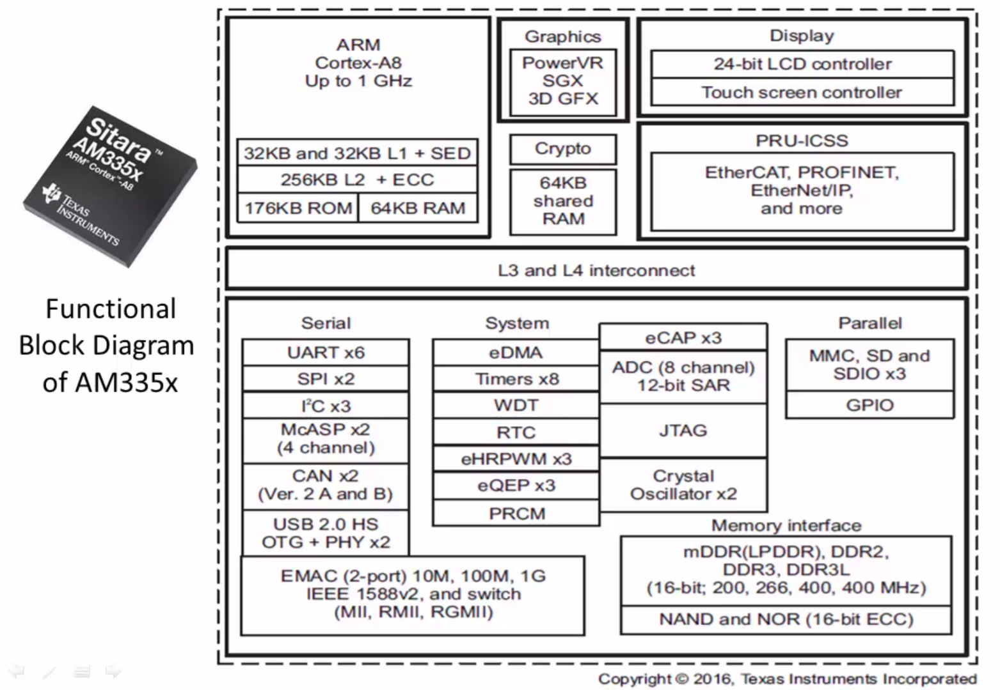

[Back to Table of Contents](../Notes.md)
***

### Section 3 of Course
## AM335x Functional block Overview

* [AM335x SOC Documentation](https://www.ti.com/product/AM3358)
* [AM335x SOC Technical Reference Manual](https://www.ti.com/lit/ug/spruh73q/spruh73q.pdf?ts=1712401820224&ref_url=https%253A%252F%252Fwww.ti.com%252Fproduct%252FAM3359)

#### Points to Note:
1. SOC has internal RAM of 128KB totally.
2. SOC has internal ROM of 176KB.

#### MMC Interface present on the Board
* MMC0 - connected to SD card slot on the board
* MMC1 - connected to eMMC storage on the board
***

[Back to Table of Contents](../Notes.md)
 
Next: [Beaglebone Linux booting Process](Beaglebone_Linux_booting_Process.md)

