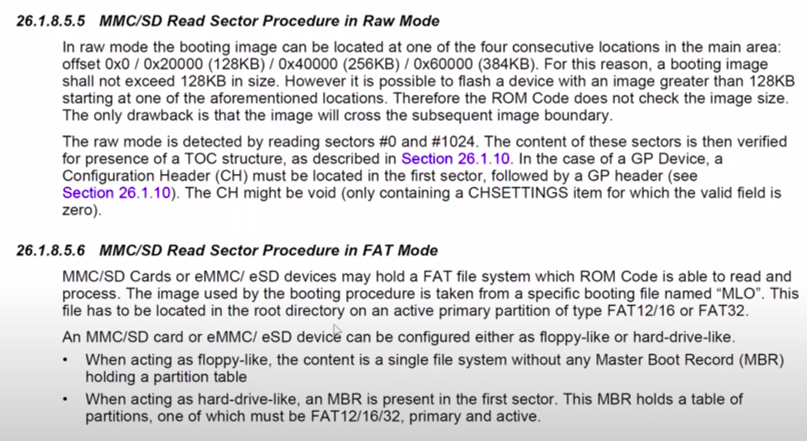
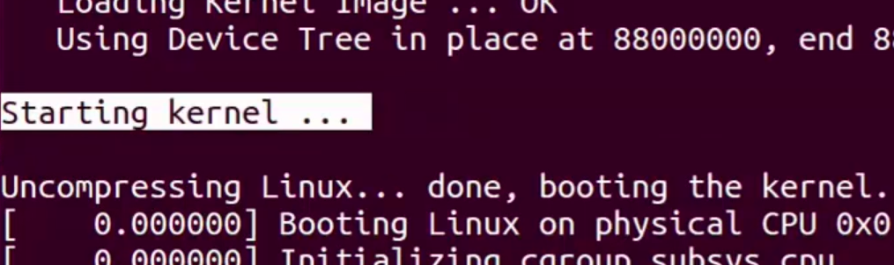

[Back to Table of Contents](../Notes.md)
***
## Additional Points to Know

* MLO can be stored in two ways:
1. In FAT File system as Image File named "MLO".
2. In RAW mode where the Image starts from the 0th address of the Storage device.

Refer the below document for more details.

* Storage can be partitioned into either of the below ways for booting:
1.

| Partition | Files | Format |
|:---------:|:-----:|:------:|
|     1     | MLO + U-Boot + uEnv.txt | FAT |
|     2     | uImage + RFS + Device Tree Binary  | EXT3/EXT4 |

-- OR --

2. 

3. Last Message printed by U-boot before it hands off the control to Linux bootstrap loader is "Starting kernel".

***

[Back to Table of Contents](../Notes.md)

