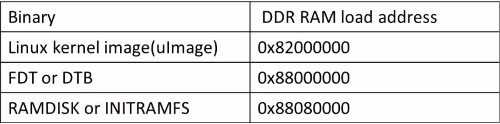

[Back to Table of Contents](../Notes.md)
***

# Booting Beaglebone Black Board from TFTP

TFTP stands for Trivial File Transfer Protocol which can be used to transfer files from TFTP server to a TFTP client. In this section, until U-boot the device boots normally from the images stored in the uSD card. We will write the uEnv.txt file in such a way that when the device arrives at U-boot, it will fetch the kernel image, DTB and initramfs from the Computer connected to it via TFTP. For this to happen we need to connect the Beaglebone Board to our Computer via a Ethernet cable. Also we need to store the files in the appropriate device as shown in the image.


### What is to be done?

1) We will keep the primary boot images like SPL, U-Boot and uEnv.txt on the SDcard.
2) We will keep other boot images like linux Kernel image, dtb and the initramfs on the linux host PC at the location /var/lib/tftpboot
3) After that we first boot the board via sd card up to U-Boot.
4) Then U-Boot reads the uEnv.txt file and executes the tftp commands to fetch and place the various boot images from tfpt server on to the DDR memory.
5) Then we will ask U-Boot to boot from the location where it placed the linux kernel image on the DDR memory.

To do all these things we need to first make our computer as TFTP server. These are the steps assuming the computer is running Linux on it.

## How to Configure the Computer as TFTP server?

1. First on your Ubuntu host run the below command using your terminal program.This command installs the tftpd , xinetd(eXtended InterNET Daemon) . tftpd is a server for the Trivial File Transfer Protocol.
```
sudo apt-get install xinetd tftp tftpd
```

2. Create/Open the file “tftp” in the below directory.
```
sudo vi /etc/xinetd.d/tftp 
```
3. Put the below entry in to this file, save and close.
```
service tftp
{
protocol = udp
port = 69
socket_type = dgram
wait = yes
user = nobody
server = /usr/sbin/in.tftpd
server_args = /var/lib/tftpboot -s
disable = no
}
```

4. Create a folder /var/lib/tftpboot and execute below commands.

```
sudo mkdir /var/lib/tftpboot
sudo chmod -R 777 /var/lib/tftpboot
sudo chown -R nobody /var/lib/tftpboot
```

5. Restart the xinetd service. Now the xinetd daemon is running.

```
sudo /etc/init.d/xinetd restart
```

That's it, now the Computer is configured as the TFTP server. But still the computer is not ready for booting.

## Getting Computer ready for Booting

1. When the TFTP client ask the computer for the files, it fetches the file from `/var/lib/tftpboot/` folder. So, the binaries should be kept at this location, Copy the prebuilt binaries (i.e. uImage, initramfs, DTB file) to this location.
2. Set the Computer IP to `192.168.27.1` as Static IP.
    * Run `ifconfig` in the terminal and copy the ethernet port name.
    
    * Run `sudo ifconfig <Ethernet name> 192.168.27.1` to make it static IP.

Now, the Computer is ready.

## Booting BBB from TFTP via U-Boot prompt

For more Information about the U-boot commands and Syntax Refer:
[U-Boot Most Useful commands and Syntax](Uboot_commands.md).


1. Power up the board while pressing the Space key on the Computer to enter the U-boot prompt mode.
2. Set the Environmental variable '_serverip_' to '_192.168.27.1_'.
```
setenv serverip 192.168.27.1
```
3. Set the Environmental variable '_ipaddr_' to '_192.168.27.2_'.
```
setenv ipaddr 192.168.27.2
```
4. Now, check the connection by pinging to the computer.
```
ping 192.168.27.1
```
You should get the ouput like the host is alive. If you have any problem, the connection is not up, check all the previous steps.


5. Now, we need to ask the computer to send the uImage (i.e. Linux kernel) and load it to RAM at address `0x82000000` according to the Recommended addresses.



```
tftpboot 0x82000000 uImage
```
This transfers the file from host Computer to Beaglebone Board as shown below.


6. Similarly, ask for other binaries as well.
```
tftpboot 0x88000000 am335x-boneblack.dtb
tftpboot 0x88080000 initramfs
```

7. Finally, set the boot arguments.
```
setenv bootargs console=ttyO0,115200 root=/dev/ram0 rw initrd=0x88080000
```
8. Now, we are ready to boot.

```
bootm 0x82000000 0x88080000 0x88000000
```

We successfully booted from the U-boot prompt. Now, we need to automate this by writing the uEnv.txt file.

## Automating the TFTP Boot using uEnv.txt
(For detailed information about writing uEnv.txt, Refer: [What is uEnv.txt](What_is_uEnv.txt.md))

1. Set the server ip and client ip.
```
serverip=192.168.27.1
ipaddr=192.168.27.2
```
2. Set the boot arguments.

```
bootargs=console=ttyO0,115200 root=/dev/ram0 rw initrd=0x88080000
```
3. Now, set the load commands from TFTP to `uenvcmd` environmental variable.
```
uenvcmd=tftpboot 0x82000000 uImage; tftpboot 0x88000000 am335x-boneblack.dtb; tftpboot 0x88080000 initramfs; bootm 0x82000000 0x88080000 0x88000000
```
So, the complete uEnv.txt will look like:

```
serverip=192.168.27.1
ipaddr=192.168.27.2
bootargs=console=ttyO0,115200 root=/dev/ram0 rw initrd=0x88080000
uenvcmd=tftpboot 0x82000000 uImage; tftpboot 0x88000000 am335x-boneblack.dtb; tftpboot 0x88080000 initramfs; bootm 0x82000000 0x88080000 0x88000000

```
(Notice the newline character at the end)


## Advantage of TFTP boot
__Faster Transfer of files from HOST PC to development board:__
During your development if you keep changing your boot binaries or file system, then tfptboot procedure will save lots of time related to transfer of those images for files to the board for testing, instead of plugging in and out the uSD card from the board.

## Transferring files from Host Computer to Beaglebone Board
Apart from boot binary transfer while booting, we can use the same protocol to transfer some random files from the Computer to Beaglebone board after the bootup as well.

#### Steps: 

1. After logging in to the linux terminal on the Beaglebone board. Check the Ethernet name of the board by running `ifconfig` command and copy the name.

2. Configure the Board IP as '_192.168.27.2_' by running the below command. (This is similar to the steps you followed while configuring IP of the Computer)
```
sudo ifconfig <Ethernet name> 192.168.27.2
```

3. Finally, check whether the connection is successful by pinging the Computer by running `ping <server ip>`. As our server ip is set to '_192.168.27.1_'.
```
ping 192.168.27.1
```
4. Now, in the Computer keep the file to be sent to Board at `/var/lib/tftp`.
5. Later, in the board terminal, type the below command. 
```
tftp -r <Filename> -g 192.168.27.1
```
(Here -r flag is given to give the name of the File to be received and -g to give the server ip)

After following all these steps the file should be transferred and placed at the current directory of the client (i.e. Receiver).

***

[Back to Table of Contents](../Notes.md)

Next: []()

Previous: []()
