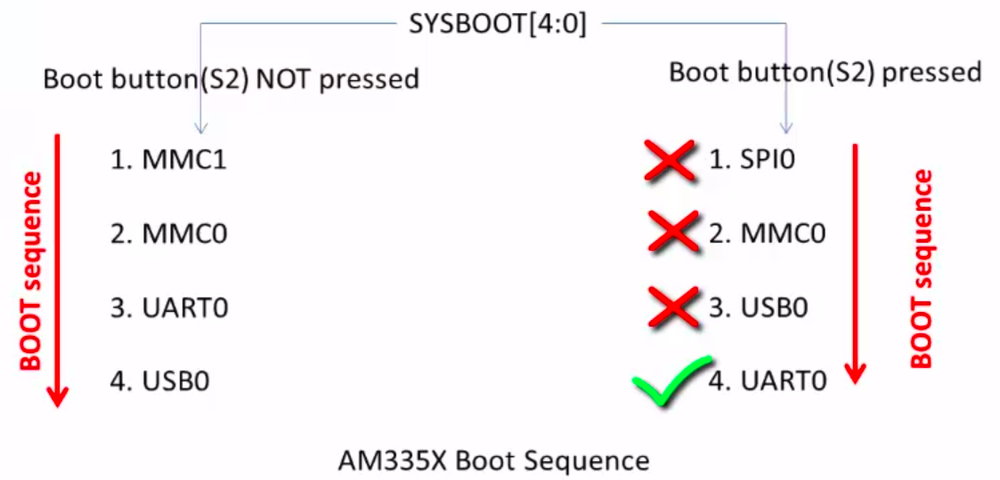
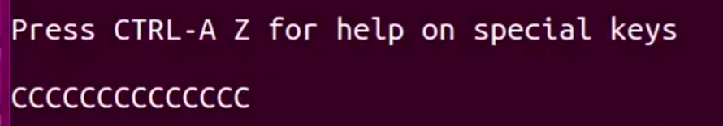
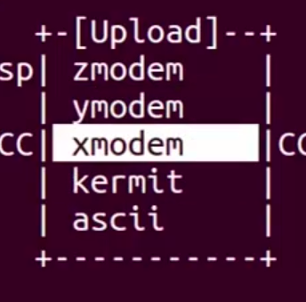
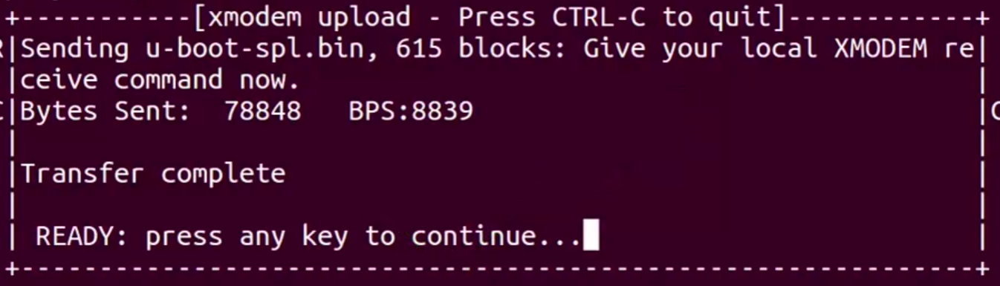
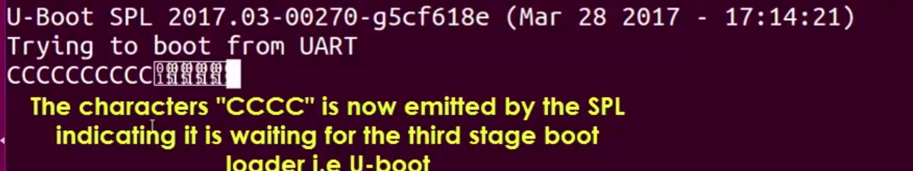
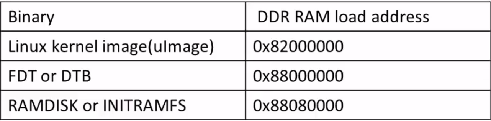

[Back to Table of Contents](../Notes.md)
***

# Booting Beaglebone Black Board from UART

In this section, we need to make sure Beaglebone black board boots from UART mode, while it is waiting for the bootloaders we will sent the SPL[^1], U-boot, Linux kernel and the Device tree Binary from UART Serially through XMODEX, YMODEX, ZMODEX protocols which we are calling as "Booting from UART".

### Prerequisite to Follow below steps:
* Remove the uSD card from the Board.
* Board shoud be preferably powered through the adapter, because theoritically before UART is checked while booting, it will check the USB port, if the port is connected to the computer then it might assume that the boot image will be sent through it and stay waiting. But when practically checked it was going to UART mode easily!! But this might not be the case always.



* Download the boot images [here](https://github.com/niekiran/EmbeddedLinuxBBB/tree/master/pre-built-images/serial-boot), if you don't have it already.

For more Information about the U-boot commands and Syntax Refer:
[U-Boot Most Useful commands and Syntax](SubsectionNotes/Uboot_commands.md).

### Steps:

1. Power up the board while pressing the S2 button on the board to make it enter into the UART mode of Boot. When it enters the UART boot mode we get CCCCCC letters in the UART.



2. Now, it is the computer's turn to send the boot image of SPL to the board through any one of the Serial communication protocols like xmodem, ymodem or zmodem. But SPL should be preferrably sent by xmodem protocol. So now Press '_Ctlr + A_' and '_s_' on the minicom terminal to enter into the serial transfer protocol modes and select xmodex. Now select the SPL binary file in the file explorer (Click here[^2] to get quick navigation tips in the file explorer of the minicom).





* After the completion of the transfer you should get the similar interface as above.

3. Now, SPL will run automatically and start waiting for the U-boot image again on UART as below.



4. Again sent the U-boot image similarly, but now using YMODEM protocol (In the course they have used XMODEM, but it is unreliable for U-boot). But as soon as the U-boot image is sent, keep pressing the '_space key_' in the keyboard to interrupt autoboot and get interactive U-boot prompt.

5. In the U-boot prompt, type the command `loadx` to get the kernel image from the XMODEM protocol and load it to the RAM at the address 0x82000000. Again send the linux kernel image from the computer.
```
loadx 0x82000000
```



6. Now, similarly get the DTB from the XMODEM protocol using `loadx` and load it to the RAM at address 0x88000000.

```
loadx 0x88000000
```

7. Next thing required is the File system but as we don't any storage element while booting (not considering eMMC because we are booting from UART remotely), we need to store the initial File system in the RAM then we can use the Real file system on the storage to continue. And this initial file system loaded in the RAM is called as '_initramfs_'. (Read more about [initramfs](https://www.learningaboutelectronics.com/Articles/How-to-generate-initramfs-file-root-file-system-linux.php)) Get the initramfs from XMODEM protocol and load to the RAM at 0x88080000.

```
loadx 0x88080000
```

8. Now, we need to tell the kernel image while booting that the initial ram file system is present at location 0x88080000 and produce the serial debug message at UART0 ('_ttyO0_'). So set the environmental variable '_bootargs_' as below.

```
setenv bootargs console=ttyO0,115200 root=/dev/ram0 rw initrd=0x88080000
```

9. That's it, now we are ready to boot the linux, type the below command. And the linux should boot properly.

```
bootm 0x82000000 0x88080000 0x88000000
```

***

[^1]: Observe that I have written as SPL instead of MLO there, as you know the MLO is Header + SPL, where the header has the information about the size of the image and RAM load address which helps to copy it to the RAM from the storage device like eMMC. But here as we are manually sending the boot images through UART, so the header is not required. So just SPL is sent instead of the whole MLO.
[^2]: To navigate Up/Down use '_Up/Down_' keys in the keyboard. Keep the cursor at the Directory you want to enter and press '_Space key_' twice. To selet the file press the '_Space key_' once and press '_Enter key_'.

***

[Back to Table of Contents](../Notes.md)

Next: []()

Previous: []()

