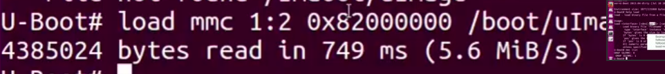
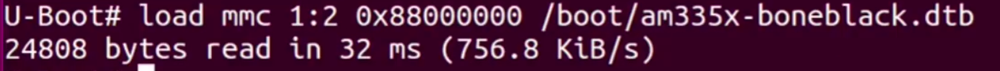
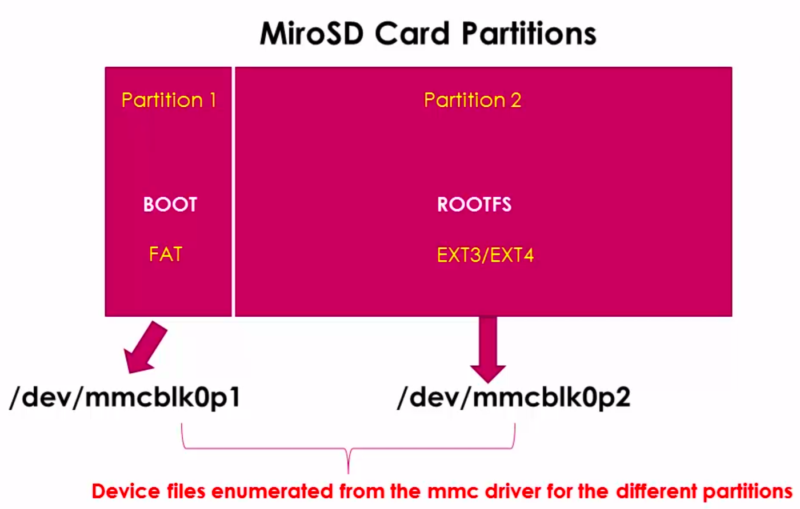

[Back to Table of Contents](../Notes.md)
***

# Booting Beaglebone Black Board from U-boot Prompt without uEnv.txt

**Important Note:** 
In the course they will Boot from eMMC storage as the older Image had two partitions. But that is not the case in the updated image. So, for time being it is not possible for us to boot from eMMC storage. But we'll Boot from the uSD card itself.

### Prerequisite to Follow below steps:
To work with the following steps, you may follow either of the below procedure:
* Remove the uSD card, delete the uEnv.txt file from the uSD BOOT partition and then insert back the uSD to the Beaglebone black board.

-- OR --

* While you give power to the board, press and hold the space of the computer to enter into U-Boot prompt. (But this method requires you press the space bar everytime you reboot the board, else it will move on to boot Linux)

For more Information about the U-boot commands and Syntax Refer:
[U-Boot Most Useful commands and Syntax](SubsectionNotes/Uboot_commands.md).

### Steps:

1. First, Load the Linux Kernel Image to the RAM at 0x82000000.

`load mmc 0:2 0x82000000 /boot/uImage`

__Important Note:__ When we run the command we need to get the respond similar to the above image, if we do not get any response then there is an error while loading (no error message is displayed).

2. Second, Load the Flattened Device tree binary to the RAM at 0x88000000.

`load mmc 0:2 0x88000000 /boot/am335x-boneblack.dtb`
(check for the exact name of the dtb file, by running _ext2ls_ command)

3. Now, the kernel is ready to boot, but it doesn't know where is the console, the baudrate of it to print the debug messages and it should also know where is the RFS present. So, we need to specify it. For Specifying these things U-boot sends an argument to the linux kernel while calling it. And the argument is '_bootargs_' (it's an environmental variable in U-boot). So set that to '_console=ttyO0,115200, root=/dev/mmcblk0p2 rw_'. (_'rw'_ is to give read write access)

`setenv bootargs console=ttyO0,115200, root=/dev/mmcblk0p2 rw`
(Note that '_ttyO0_' is the UART0 of the board)

4. That's it, now let's boot the kernel by specifying the '_bootm_' command.

`bootm 0x82000000 - 0x88000000`

***

[Back to Table of Contents](../Notes.md)

Next: 

Previous: 
