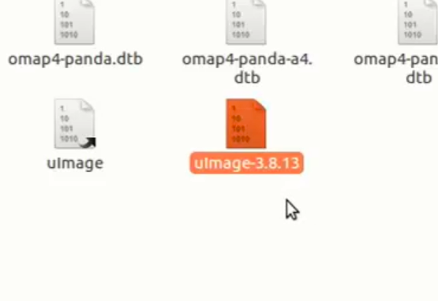
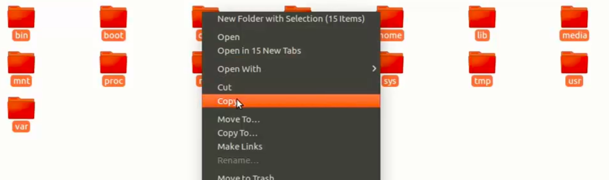

[Back to Table of Contents](../Notes.md)
***
# Booting Beaglebone Black Board from the SD card

Storage can be partitioned into either of the below ways for booting:

1.

| Partition | Files | Format |
|:---------:|:-----:|:------:|
|     1     | MLO + U-Boot + uEnv.txt | FAT |
|     2     | uImage + RFS + Device Tree Binary  | EXT3/EXT4 |

-- OR --

2. 

### Overview of Booting through uSD card


#### Prebuilt binaries of MLO, U-boot, Linux image from Angstrom Repository can be found at:

[GitHub Page: Angstrom Demo](https://github.com/niekiran/EmbeddedLinuxBBB/tree/master/pre-built-images/Angstrom_Demo)

**Steps:**

1) Take an uSD card (4GB >= ) and partition it to two as shown below.
(For more information about partitioning uSD card read: [How to Partition the uSD card for Booting](SubsectionNotes/How_to_Partition_uSD_card.md))


2. Next, Copy the MLO file to the BOOT partition of the uSD card and Rename it as "MLO". You need root privilege to copy it, so use 'sudo' as said earlier. (Refer [Important Note](SubsectionNotes/How_to_Partition_uSD_card.md))

```
sudo cp <path of the MLO file> /media/<username>/BOOT/MLO
```

3. Then, Copy the U-boot file to the BOOT partition of the uSD card and Rename it as "u-boot.img". 


```
sudo cp <path of the u-boot.img file> /media/<username>/BOOT/u-boot.img
```


4. Later, Download the RFS (Root File system) from the provided source and extract it. Here if you go inside the boot folder, "uImage" file is the Linux Image. Now, come back and copy all the folders into the ROOTFS partition of the uSD card. And then run "sync".


```
sudo cp -r <path of the RFS folder>/* /media/<username>/ROOTFS/
sync
```




5. Finally, Copy uEnv.txt file from the provided source to the BOOT partition of the uSD card.

```
sudo cp <path of the uEnv.txt file> /media/<username>/BOOT/uEnv.txt
```

6. That's it, now umount the uSD card from the computer and plug it to the Beaglebone board and Power on the board while pressing the **S2 button** on the board. Now it should boot from the uSD card.

***

[Back to Table of Contents](../Notes.md)

Next: []()

Previous: [Beaglebone Linux booting Process (Section 4 of Course)](Beaglebone_Linux_booting_Process.md)
