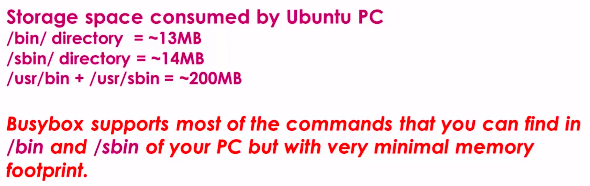
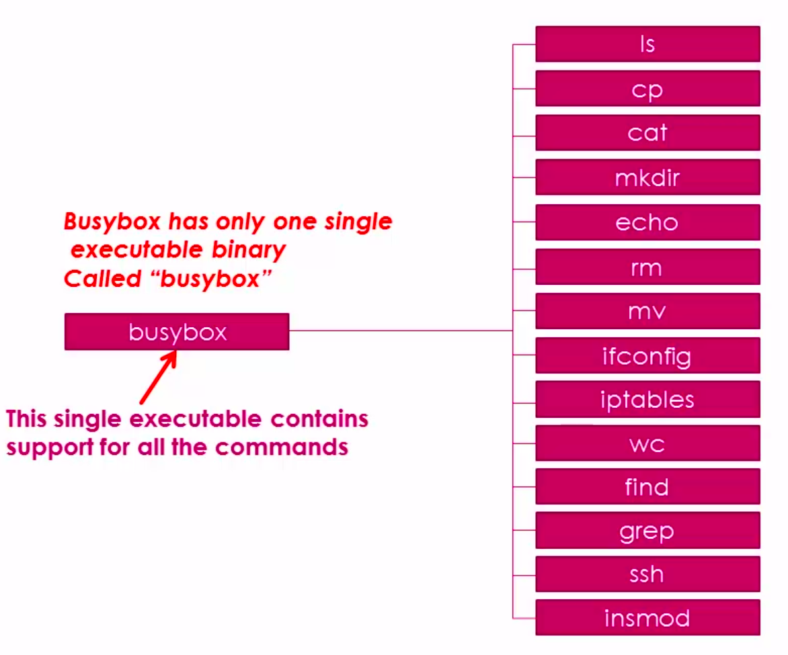
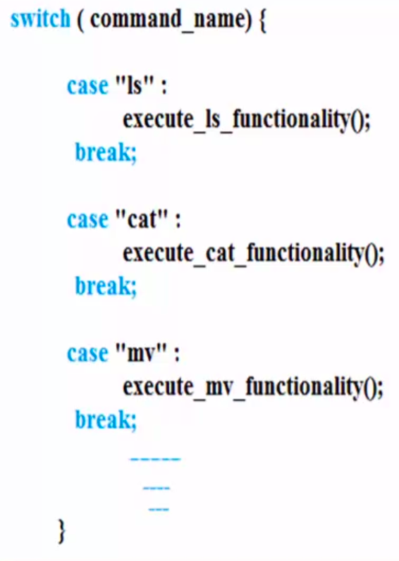

[Back to Table of Contents](../Notes.md)
***

# Busybox Introduction

### What is Busybox?

Busybox is a software tool to create a customized root file system for your embedded linux products. We can generate RFS from Basic to Advanced.

### Why Busybox?

1. It enables you to create customized file system that meets your resource requirements.

2. If your product is resource limited in terms of memory, then you can customize the files system such a way that, it can fit, in to your product with limited memory space.

3. You can use this tool to remove all unwanted features which your product doesn't need, like you can remove unwanted Linux commands and features, directories, etc. using the customization tool.

4. Busybox has the potential to significantly reduce the memory consumed by various Linux commands by merging all the Linux commands in one single binary.

* Busy box reduces the memory by merging all the commands into one single executable binary called "Busybox". This Busybox command is implemented as a switchcase statement in C as shown below.

***

[Back to Table of Contents](../Notes.md)
