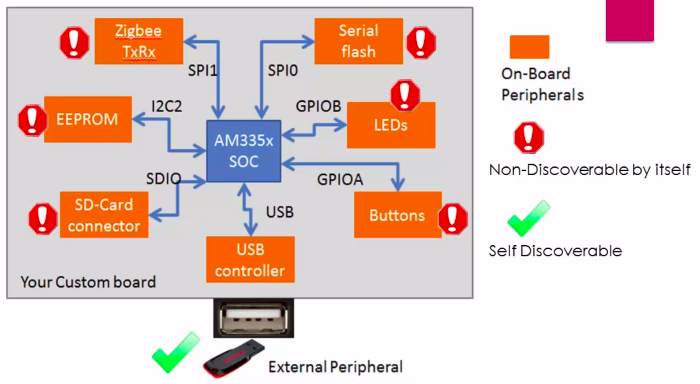

[Back to Table of Contents](../Notes.md)
***

# Why Flattened Device Tree is required?

* The on-board peripheral devices which connect to SPI, I2C, SDIO, ETHERNET, etc have no capability to announce their existence on the board by themselves to the operating system. These peripherals are also called as "Platform devices".
* USB device has the inbuilt intelligence to send its details to the operating system. (that means USB supports dynamic discoverability)

### There are mainly two ways to tell Linux about the platform devices:
1. Static method - By providing the my-board-config.c file to the kernel, but this comes with a cost. We need to recompile the Kernel everytime we change this file. That is why it is called Static method.

* When a driver for a particular platform peripheral is loaded, the Linux calls the "probe" function of the driver if there is any match in its platform device database. In the "Probe" function of the driver, you can do device initializations.

* Another problem is the Kernel Image for every board will be different even though the SOC is same, this is not good as we need to re-compile the kernel image everytime we change the board.

2. Dynamic method - The Linux community wanted to cut off the dependencies of platform device enumeration from the Linux kernel, that is, hard coding of platform device specific details in to the Linux kernel. So they introduced "Flattened Device Tree".

Instead of adding hard coded hardware details in to the linux kernel board file, every board vendors has to come up with a file called DTS.
This file actually consists of all the details related to the board written using some pre defined syntaxes. So you can say that this file consists of data structures which describe all the required peripherals of the board. 

This file is compiled by a Special Compiler called "dtc" which stands for Device tree compiler. When you edit the DTS file to add a new entry, you need not to compile the kernel again, you just have to compile the DTS to obtain the new DTB.

***

[Back to Table of Contents](../Notes.md)

