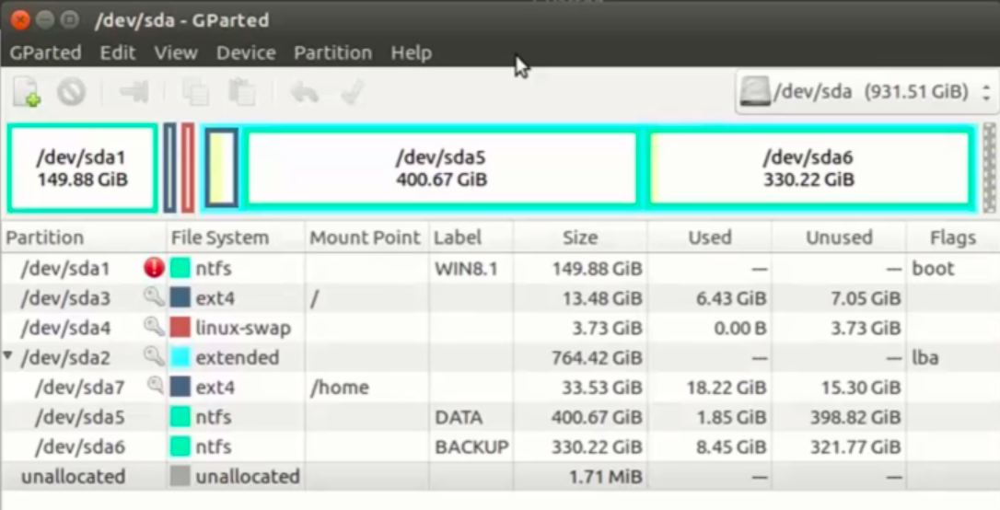
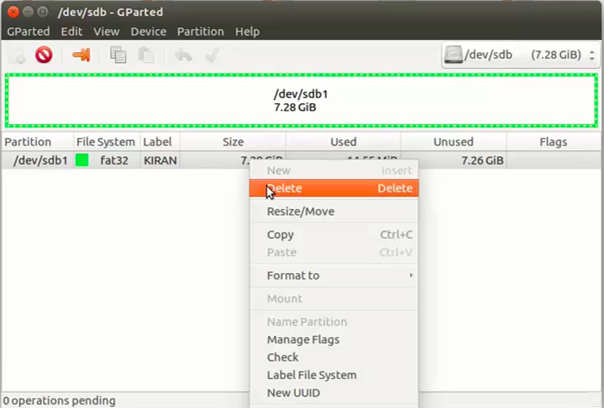

[Back to Table of Contents](../Notes.md)
***

## How to Partition the uSD card for Booting

**Important Note:** For the following steps, Don't operate as the Super User (i.e. root) in the command line. If we require any higher privileges, we may use it with "sudo".
 
 

1. Connect the uSD card to the Computer (Linux machine) and run the command `dmesg` and check for the device name(like sdb1 or sda2) of the uSD card.

 
2. Install an app called "GParted" and open it.

 
3. Choose the correct device from the list of devices.

 
4. Umount the uSD card.

 
5. Delete the partition.

 
6. Create a new partition named "BOOT" with File system as "fat16" and size around 1GB (or 1024 MiB).

 
7. Similarly create another partition named "ROOTFS" with File system as "ext3" and leave the size as it is (it will take the remaining size in the uSD card).

 
8. Finally don't forget to click apply.
 
9. Mark BOOT Partition as BOOT by going to manage flags and check the boot flag.

 
10. Close the Application.
***

[Back to Table of Contents](../Notes.md)

