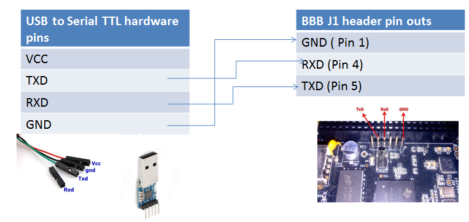

[Back to Table of Contents](../Notes.md)
***

## How to connect Beaglebone Black to computer through Serial Communication

For More Information check the Udemy article page. This is explained thorougly in it.
 
[Connecting BBB to PC using external USB TO UART Converter](https://www.udemy.com/course/embedded-linux-step-by-step-using-beaglebone/learn/lecture/7243976#overview)

***

[Back to Table of Contents](../Notes.md)

