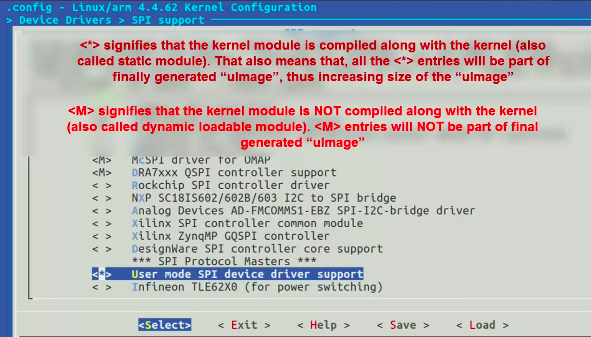
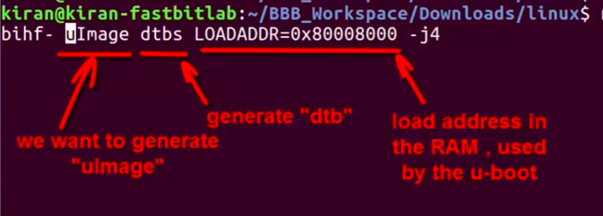

[Back to Table of Contents](../Notes.md)
***

Download/Clone the repository for the latest [Linux source code for Beaglebone Board](https://github.com/beagleboard/linux).
(Downloading the Zip file is recommended, If you are not planning to contribute to the repository because cloning downloads .git file which has the size equal or more than the source code and it is not necessary)

### Important Note:

Before we compile, we need to install the Cross compilation toolchain. If you have not done it already you may refer the section [Steps to Install Cross compilation toolchain](U-Boot_Compilation.md).

# How to Configure and Generate Linux Image

1. Go inside the downloaded Linux source code directory and do `distclean`, this deletes all the previously compiled/generated object files. Execute the command as below. However, this step is optional if you are starting fresh.
```
make ARCH=arm CROSS_COMPILE=arm-linux-gnueabihf- distclean
```
2. Now, we need to apply the board default configurations by using the default config file given by the board manufacturer. For Beaglebone Black board it is '_bb.org_defconfig_'.
```
make ARCH=arm CROSS_COMPILE=arm-linux-gnueabihf- bb.org_defconfig 
```

* It generates a file called '_.config_', and it contains all the configurations of the board. However we should not modify this file at any cost. When we do `distclean` this file will be deleted, deleting our configurations.

3. Now, either we can proceed to the compilation with the default configuration or we change some of the configuration according to our needs. To change the configuration, we can run `menuconfig` as below.

```
make ARCH=arm CROSS_COMPILE=arm-linux-gnueabihf- menuconfig
```
* For Eg. we may want to do some driver related configuration like, make a driver dynamically or statically loaded. You may read the text in the image for more info.



4. Finally, we are ready to compile the source code.

```
make ARCH=arm CROSS_COMPILE=arm-linux-gnueabihf- uImage dtbs LOADADDR=80008000
```


(If you know how many cores your machine have, you may specify it in the command which makes it faster. However, this is not mandatory and not recommended if you are not sure about the number of cores)
* For 4 core machine
```
make arch=arm cross_compile=arm-linux-gnueabihf- uimage dtbs loadaddr=80008000 -j4
```
* For 8 core machine
```
make arch=arm cross_compile=arm-linux-gnueabihf- uimage dtbs loadaddr=80008000 -j8
```

5. Remember that, we have not yet compiled the kernel modules which we chose to not to compile with the kernel itself. So, we need to do it now.

```
make ARCH=arm CROSS_COMPILE=arm-linux-gnueabihf- modules 
```
(Again, you may use -j8 or -j4)

6. Next step is to install all the compiled modules to the Root File system. If you have the RFS ready you may do it, if you don't have it ready, you may refer [How to use Busybox to create a Minimal RFS?](How_to_use_Busybox.md) to generate it. 

```
make ARCH=arm CROSS_COMPILE=arm-linux-gnueabihf- INSTALL_MOD_PATH=<path of the RFS> modules_install
```

***

[Back to Table of Contents](../Notes.md)
