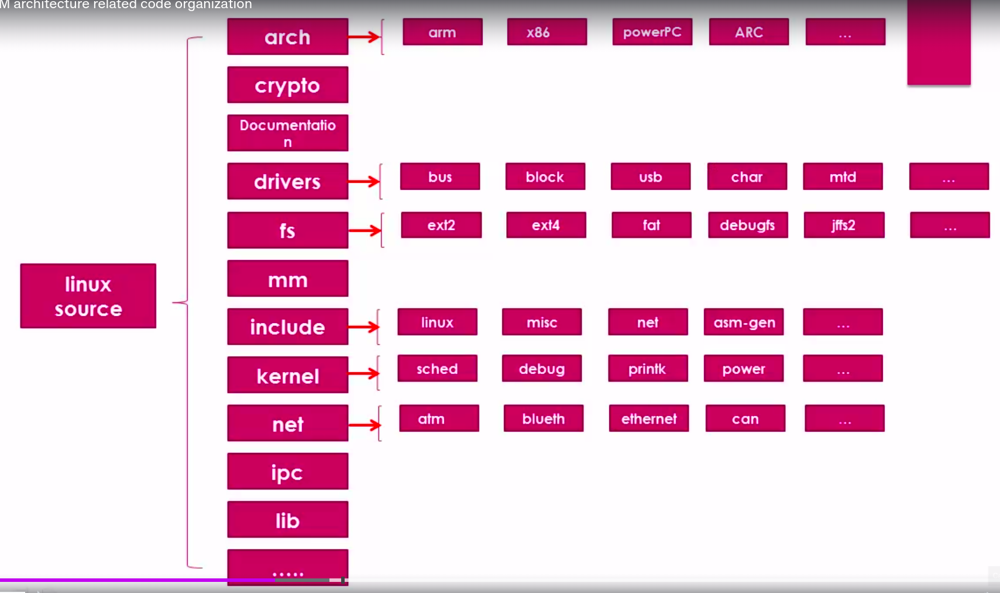

[Back to Table of Contents](../Notes.md)
***

Download/Clone the repository for the latest [Linux source code for Beaglebone Board](https://github.com/beagleboard/linux).
(Downloading the Zip file is recommended, If you are not planning to contribute to the repository because cloning downloads .git file which has the size equal or more than the source code and it is not necessary)

# Understanding the Linux Source Tree

***

[Back to Table of Contents](../Notes.md)
