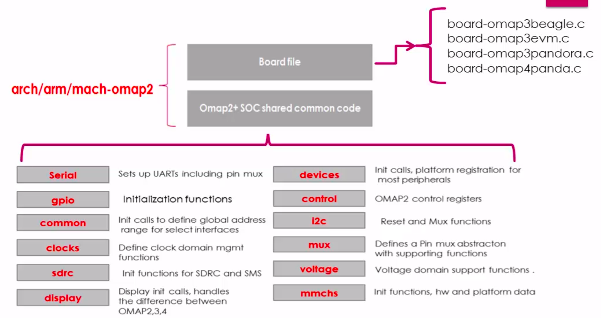

[Back to Table of Contents](../Notes.md)
***

Download/Clone the repository for the latest [Linux source code for Beaglebone Board](https://github.com/beagleboard/linux).
(Downloading the Zip file is recommended, If you are not planning to contribute to the repository because cloning downloads .git file which has the size equal or more than the source code and it is not necessary)

# Understanding the Linux Source Tree

1. As you know, Linux supports differents architectures and there are architecture dependent files as well as architecture independent files in the linux source directory and it is organised as below.

2. You may check the location `<linux source directory>/arch` in which the processor specific, architecture specific, and board specific files are located.
3. You may find the ARM processor specific codes like codes which handle MMU, Exceptions, Cache memory, etc. in the below locations shown in the image.

4. And the code specific to the SOC will be found in the folders below which has the prefix '_mach_'. Observe that our SOC '_am335x_' is under Texas Instrument OMAP i.e. '_mach-omap2_'.

5. The board file is a 'C' source file, which explains the various peripherals on the board (out side the SOC). This file usually contains the registration functions and data of various on board devices, e.g for Ethernet phy, eeprom, leds, Icds, etc. Basically the board vendor uses this board file to register various board peripherals with the Linux subsystem.

6. Machine shared common code, contains various 'C' source files which contain the helper functions to initialize and deal with the various on chip peripherals of the SOC and these codes are common among all the SOCs which share common IP for the peripherals.

7. These are the contents of the Board specific and SOC specific files. Note that you may even change these file according to the requirements of your product.

8. Old Linux had config files before the introduction of [Flattened Device tree](Flattened_Device_Tree.md) as below. Naming covention of these files were board-<Name of the board\>.c. We had the board config files different for every board and it was like as shown in the screenshot. For reference this is linux version 3.4.

9. In the newer Linux, we have only one board file '_board-generic.c_'. And all the other details are moved to the Device Tree file.

10. The Drivers related to different devices can be found in '_drivers_' directory in the linux source code directory. Our SOC has all these interfaces and the drivers for it can found in that directory.

***

[Back to Table of Contents](../Notes.md)
