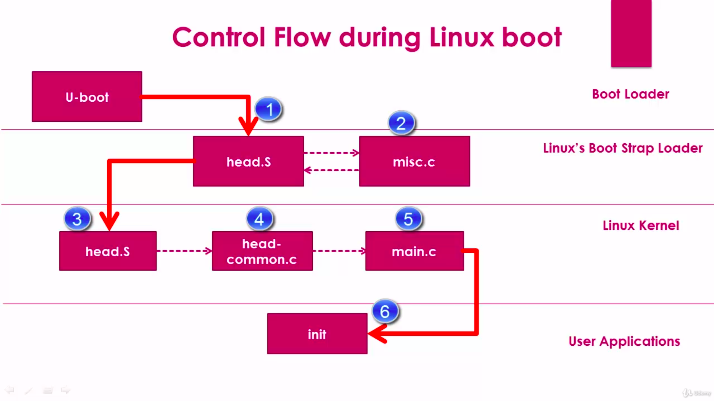

[Back to Table of Contents](../Notes.md)
***
## Linux Boot Strap Loader Flow

**head.s:** This is the architecture specific assembly file which initializes the Linux kernel loading.

**misc.c:** This is also called Miscellaneous file decompresses the Linux kernel file and hands it back to head.s file.

**head.s(in Linux kernel):** It is the generic architecture specific file to initialize the core and other low level peripherals for starting the kernel.
**head-common.c:** It is the common file for initializing the kernel.

__Main function of head.s and head-common.c:__

* This does CPU specific initialization.
* Check for valid processor architecture.
* Page table initialization.
* Identify, prepare and enable MMU for identified processor architecture for the virtual memory.
* Calls "start_kernel.c" function of the main.c (Architecture independent code).

**main.c:** This is the main function of the kernel.

**init:** This is the first user space program started by the kernel.

### Additional Links:
Source code of [U-boot](https://ftp.denx.de/pub/u-boot/).
***

[Back to Table of Contents](../Notes.md)

Next: 

Previous: 
