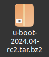

[Back to Table of Contents](../Notes.md)
***

Download the latest [Source code of U-boot](https://ftp.denx.de/pub/u-boot/).



# How to compile the U-Boot from its source code

Before we compile, we need to install the compilation toolchain. This toolchain is called Cross compilation toolchain because it is compiled at a host machine and run in a different machine (target machine). The other type of toolchain is called native toolchain where the compilation and running is on the same machine.

## Steps to Install Cross compilation toolchain

1. Let's download it from [releases.linaro.org](https://releases.linaro.org/components/toolchain/binaries/), choose the lastest release, select '_arm-linux-gnueabihf_' ('_hf_' stands for hardfloat), download the toolchain according to your host machine processor (Better if Linux based Host machine) and Extract.


2. Now, we need to include the path of the `bin` directory of the toolchain to the '_.bashrc_' file. Open `/home/<username>/.bashrc` or `/etc/bash.bashrc` and include a line as below.

```
export PATH=$PATH:<Toolchain Path>/gcc-linaro-7.5.0-2019.12-x86_64_arm-linux-gnueabihf/bin
```
(Don't forget to change the actual path of the folder in the place of <Toolchain Path\>)

3. Run command `source /home/<username>/.bashrc` or `source /etc/bash.bashrc` to get the effect of the previous step.
4. Now, to verify the toolchain installation, open the terminal and type '_arm_' and press the tab key couple of times, you should see the result as below.


## U-Boot Compilation

1. Go inside the downloaded U-boot source code directory and do `distclean`, this deletes all the previously compiled/generated object files. Execute the command as below. However, this step is optional if you are starting fresh.
```
make ARCH=arm CROSS_COMPILE=arm-linux-gnueabihf- distclean
```
2. Now, we need to apply the board default configurations by using the default config file given by the board manufacturer. For Beaglebone Black board it is '_am335x_evm_defconfig_'.
```
make ARCH=arm CROSS_COMPILE=arm-linux-gnueabihf- am335x_evm_defconfig
```

* It generates a file called '_.config_', and it contains all the configurations of the board. However we should not modify this file at any cost. When we do `distclean` this file will be deleted, deleting our configurations.

3. Now, either we can proceed to the compilation with the default configuration or we change some of the configuration according to our needs. To change the configuration, we can run `menuconfig` as below.

```
make ARCH=arm CROSS_COMPILE=arm-linux-gnueabihf- menuconfig
```
4. Finally, we are ready to compile the source code.

```
make ARCH=arm CROSS_COMPILE=arm-linux-gnueabihf-
```
(If you know how many cores your machine have, you may specify it in the command which makes it faster. However, this is not mandatory and not recommended if you are not sure about the number of cores)
* For 4 core machine
```
make ARCH=arm CROSS_COMPILE=arm-linux-gnueabihf- -j4
```
* For 8 core machine
```
make ARCH=arm CROSS_COMPILE=arm-linux-gnueabihf- -j8
```

***

[Back to Table of Contents](../Notes.md)
