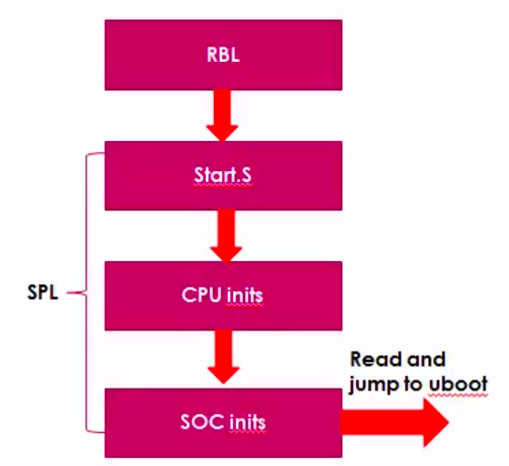
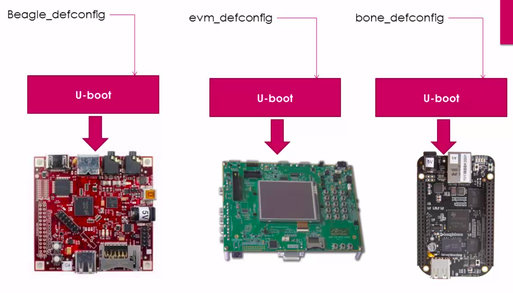

[Back to Table of Contents](../Notes.md)
***

Download the latest [Source code of U-boot](https://ftp.denx.de/pub/u-boot/).

# Understanding U-Boot Source tree

* Before starting, We need to know that the SPL is also a part of U-Boot. They are provided in the same software package. But they are loaded and executed separately. So when we explore the parts of U-Boot folders we encounter some SPL codes as well. Don't get confused there.

* U-boot supports different architectures like avr, arm, powerpc, x86, etc. You may check those in location `<uboot source directory>/arch`. You will find architecture related code. If you go inside further and find `cpu` directory you can find different cpu supported and inside a specific cpu directory, you will find all the cpu specific initialization files. Find a file called '_start.S_', it is where the SPL gets control from RBL.

* U-boot supports different boards. You may check those in location `<uboot source directory>/board`. You will find board related code. Under a specific board directory you will find different SOCs folders. If you go inside further you will find board.c and board.h which are board specific initialization files.
* When you get a new board and you don't know how to configure (i.e. what are the features to enable/disable). The board developers give a default configurations for getting started. And these files can be found at location `<uboot source directory>/configs/`. In our case, for Beaglebone Black board we use `am335x_evm_defconfig` (Although in the course they use a different one, but it is deprecated and removed).

***

[Back to Table of Contents](../Notes.md)
