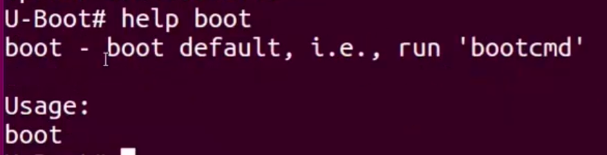
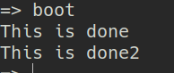

[Back to Table of Contents](../Notes.md)
***

# What is uEnv.txt?
As you know, when we were booting the kernel from [U-Boot prompt](Booting_BBB_from_Uboot_prompt.md), we loaded different files (like uImage, DTB file) manually from different locations, also manually configured the baudrate and RFS, etc. But everytime we cannot do it manually, there should be an automation script to do these things automatically while booting up and that is this uEnv.txt. Whatever commands we gave it in the prompt, will be put into this file and while booting, it will automatically run all the commands for us and save our time.

But there is a catch here... uEnv.txt file is not like other automation scripts. The commands simply put inside it will not be executed!! This file is primarily for assigning the values for the Environmental variables. This means that we can only put the Environmental variables and its values (like `variable_name=value`) inside it and it will be assigned by the U-boot. But how does this help?

We are taking advantage of two things here,
1. We know that commands put inside the environmental variables can be executed using `run <environmental variable>` command. 

Eg. 
```
> setenv testcmd echo This is done
> run testcmd

----------------OUTPUT--------------------

This is done
```
* Also we know that we can put more than one command inside same environmental variable and it will be executed one after the other as below.

Eg. 
```
> setenv testcmd1 echo This is done
> setenv testcmd2 echo This is done2
> setenv mastercmd 'run testcmd1; run testcmd2' 
> run mastercmd 

----------------OUTPUT--------------------

This is done
This is done2
```

2. And we are also taking advantage of a special Environmental variable called '_bootcmd_' which runs at the startup as you can see below. (But as I have looked into built-in uEnv.txt file, they will use another variable called '_uenvcmd_').



So, What is the idea here?

We will put all the commands we wish to run at startup into '_bootcmd_' environmental variable inside the '_uEnv.txt_' file. So that when the U-boot assigns the commands to the '_bootcmd_' variable and runs it, indirectly it is running the commands we wished to run!!

## How to write uEnv.txt file?

uEnv.txt is straight forward file, we need to just put the environmental variables and values list one below other, that's it.

Syntax:

`<Environmental_variable_name>=<value>`

Remember to put a newline character at the end of the file. And this is mandatory.

Eg.
```
testcmd1=echo This is done
testcmd2=echo This is done2
bootcmd=run testcmd1;run testcmd2

```

(Notice the newline character at the end)

OUTPUT:




Okay, now let's do some useful stuff. So what are the things we need to have in the uEnv.txt file?

* We need to set the '_bootargs_' environmental variable to `console=ttyO0,115200 root=/dev/mmcblk0p2 rw`.

```
bootargs=console=ttyO0,115200 root=/dev/mmcblk0p2 rw
```

* And put all the commands to run in '_bootcmd_' like below.

```
bootcmd=load mmc 0:2 0x82000000 /boot/uImage; load mmc 0:2 0x88000000 /boot/am335x-boneblack.dtb; bootm 0x82000000 - 0x88000000 
```

* Usually, serverip (Host IP Address) and ipaddr (Target IP Address) will be mentioned here:

```
serverip=192.168.1.2
ipaddr=192.168.27.1
```

(For more information about all the commands used here refer: [Booting BBB from U-Boot Prompt](Booting_BBB_from_Uboot_prompt.md))

So, the complete uEnv.txt will look like:
```
serverip=192.168.1.2
ipaddr=192.168.27.1
bootargs=console=ttyO0,115200 root=/dev/mmcblk0p2 rw
bootcmd=load mmc 0:2 0x82000000 /boot/uImage; load mmc 0:2 0x88000000 /boot/am335x-boneblack.dtb; bootm 0x82000000 - 0x88000000 

```

(Notice the newline character at the end)

We may also make it more readable like below:

```
serverip=192.168.1.2
ipaddr=192.168.27.1
imageaddr=0x82000000
dtbaddr=0x88000000
bootargs=console=ttyO0,115200 root=/dev/mmcblk0p2 rw
bootcmd=load mmc 0:2 ${imageaddr} /boot/uImage; load mmc 0:2 ${dtbaddr} /boot/am335x-boneblack.dtb; bootm ${imageaddr} - ${dtbaddr} 

```
***

[Back to Table of Contents](../Notes.md)

Next: []()

Previous: []()


